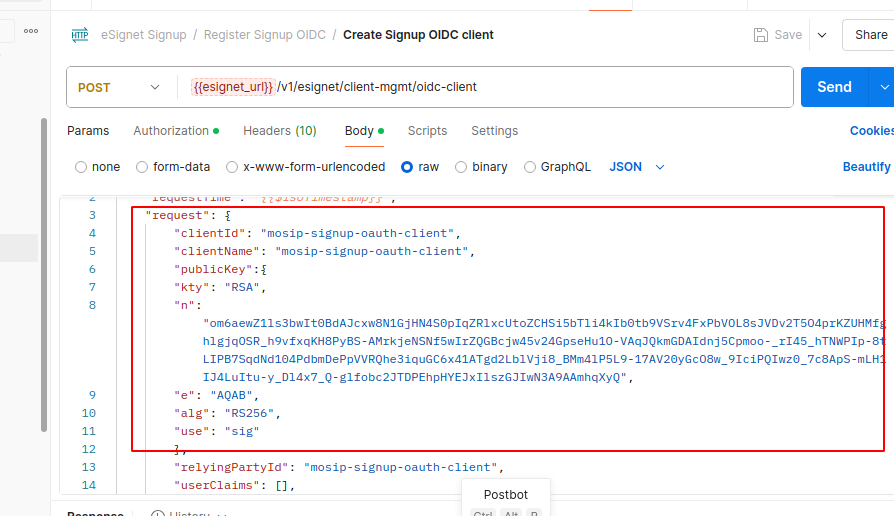

# eSignet Signup

## Overview

This repository contains a signup UI and signup service to handle signup operations by the end user. This module can be
used to fast-track the availability of any digital service to end users via eSignet. eSignet has built-in support for the
integration with the signup module. The signup service is flexible to connect to any ID registry system via a well-defined plugin interface.

Currently, signup supports below features:
1. Register User
2. Reset password
3. Online video based identity verification workflow integration via plugin

## Build (for developers)
The project requires JDK 11.
1. Build:
    ```
    $ mvn clean install -Dgpg.skip=true -Dmaven.gitcommitid.skip=true
    ```

## Installing in k8s cluster using helm

signup-service is part of the esignet, but has a separate Helm chart to install and manage it in a completely independent namespace.

### Pre-requisites
1. Set the kube config file of the Esignet k8 cluster having esignet services is set correctly in PC.
1. Below are the dependent services required for signup service integrated with [Mock Identity System](https://github.com/mosip/esignet-mock-services/tree/master/mock-identity-system)
   | Chart | Chart version |
   |---|---|
   |[Keycloak](https://github.com/mosip/mosip-infra/tree/v1.2.0.1-B3/deployment/v3/external/iam) | 7.1.18 |
   |[Keycloak-init](https://github.com/mosip/mosip-infra/tree/v1.2.0.1-B3/deployment/v3/external/iam) | 12.0.1-B3 |
   |[Kafka](https://github.com/mosip/mosip-infra/tree/v1.2.0.1-B3/deployment/v3/external/kafka) | 0.4.2 |

### Setup pre-requisites for signup services
```
cd deploy
./prereq.sh
```
### Install Signup service
* Install `kubectl` and `helm` utilities.
* Run `install-signup.sh` to deploy signup services.
  ```
  cd deploy
  ./install-signup.sh
  ```
### Delete
* Run `delete-signup.sh` to remove signup services.
  ```
  cd deploy
  ./delete-signup.sh
  ```
### Restart
* Run `restart-signup.sh` to restart signup services.
  ```
  cd deploy
  ./restart-signup.sh
  ```
### Additional services required
To complete the signup portal deployment below MOSIP kernel services are required to be deployed.
* otpmanager
* authmanager
* auditmanager
* notifier

* Initialize the db script to create mosip_kernel and mosip_audit databases make sure to update the existing db-common-secret in init_values.yaml if postgres-initialization already done
  * copy db-common-secret from existing postgres deployment secret if its already created
  * run the postgres-init.sh
  ```
    cd deploy
    ./postgres-init.sh
  ```
#### Prerequisites for MOSIP kernel services:
1. msg-gateway
2. config-server
3. artifactory
4. mock-smtp
5. kernel
```
  cd deploy (follow the above sequence and run the install.sh for each module installation)
  
```  
## Partner onboarding
* Partner onboarding for esignet Signup OIDC client with mock can be performed manually with below steps
* Download and import eSignet Signup.postman_collection.json and eSignet Signup.postman_environment.json postman collection from [here](./postman-collection)

# OIDC Client Management Instructions
1. Fetch the Authentication Token
   * Navigate to **"Register Signup Oidc "** → "Get Auth Token" to retrieve the authentication token.
     * Update the client_secret (retrieve it from the keycloak-client-secrets).
     * Update the iam_url (Keycloak URL) in the request body.
     * Retrieve the Keycloak URL from the config-map under keycloak-host → keycloak-external-url.

2. Navigate to **"Register"** → **"Get CSRF token"** →  **generate CSRF token** → to fetch the CSRF token.

3. Execute `create-signup-oidc-keystore.sh` [here](./docs/create-signup-oidc-keystore.sh) to generate a keypair. This script after successful execution creates 2 files in the project root directory:
    oidckeystore.p12
    public_key.jwk

    * As esignet only supports confidential OIDC clients, we should generate a RSA keypair to onboard signup-service. RSA private key is stored in the oidckeystore.p12 file and the corresponding public key is written to public_key.jwk file.
    * Copy the public key in public_key.jwk file and update the same in the Register Signup OIDC/Create Signup OIDC client request body.
      * 

4. Run Register Signup OIDC/Create Signup OIDC client in postman before starting the identity verification flow.
   * Navigate to **"Register Signup Oidc "** -> **"Create Signup OIDC client"**
     * Update the Request Fields for OIDC Client Creation
     * Before executing the "Create Signup OIDC Client" request, update the following fields in the request body:
         * esignet_url
         * client-name
         * client-id
         * logo-uri
         * redirect-uri
     * Execute the request.
    *  Make sure to update the `signup-keystore-password` in the secrets as passed while creating the p12 file.

5. Mount oidckeystore.p12 as a `signup-keystore` secret to the **signup deployment**.

6. Make sure to update the `signup-keystore-password` in the secrets as passed while creating the p12 file.

# APIs
API documentation is available [here](docs/esignet-signup-openapi.yaml).

## License
This project is licensed under the terms of [Mozilla Public License 2.0](LICENSE).
