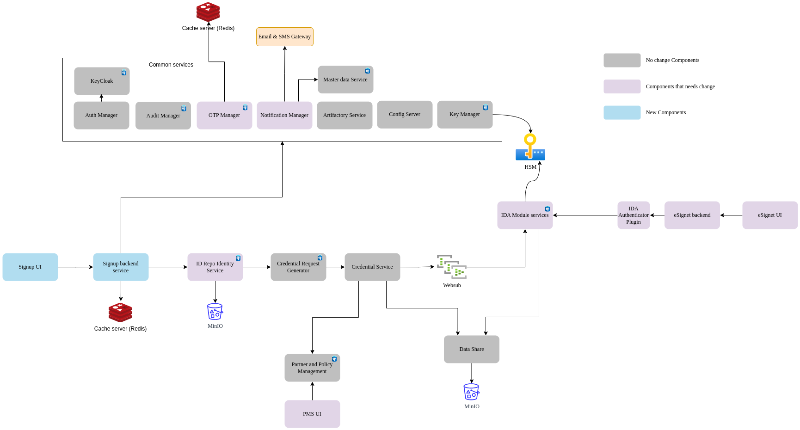

# esignet-signup

signup-service is part of the esignet modules, but has a separate Helm chart so as to install and manage it in a completely independent namespace.

Below diagram depicts the high level deployment architecture for signup service with MOSIP ID-repo.



### Configurations
Signup service and signup UI currently supports default [ID schema](docs/id-schema.json) only.

**Note:**
Work is in progress to support any ID schema and also to connect with any registry services.

With respect to the default ID schema, below MOSIP configurations are required to be updated.

#### admin-default.properties
``
mosip.admin.masterdata.lang-code=eng,khm
``

#### application-default.properties
```
mosip.mandatory-languages=eng,khm

mosip.optional-languages=

mosip.default.template-languages=eng,khm
```

#### id-authentication-default.properties
```
request.idtypes.allowed=UIN,HANDLE

request.idtypes.allowed.internalauth=UIN

ida.mosip.external.auth.filter.classes.in.execution.order=io.mosip.authentication.hotlistfilter.impl.PartnerIdHotlistFilterImpl,io.mosip.authentication.hotlistfilter.impl.IndividualIdHotlistFilterImpl,io.mosip.authentication.hotlistfilter.impl.DeviceProviderHotlistFilterImpl,io.mosip.authentication.hotlistfilter.impl.DeviceHotlistFilterImpl,io.mosip.authentication.authtypelockfilter.impl.AuthTypeLockFilterImpl

mosip.ida.handle-types.regex={ '@phone' : '^\\+91[1-9][0-9]{7,9}@phone$' }
```

####  id-repository-default.properties
```
mosip.idrepo.credential.request.enable-convention-based-id=true

mosip.idrepo.identity.disable-uin-based-credential-request=false

mosip.idrepo.vid.disable-support=true

mosip.identity.fieldid.handle-postfix.mapping={'phone':'@phone'}
```

#### kernel-default.properties
``
mosip.kernel.sms.country.code=+91
``


## Installing in k8s cluster using helm
### Pre-requisites
1. Set the kube config file of the Mosip cluster having dependent services is set correctly in PC.
2. Make sure [DB setup](db_scripts/README.md#install-in-existing-mosip-k8-cluster) is done.
3. Add / merge below mentioned properties files into existing config branch:
   * [signup-default.properties](https://github.com/mosip/mosip-config/blob/v1.2.0.1-B3/esignet-default.properties)
   * [application-default.properties](https://github.com/mosip/mosip-config/blob/v1.2.0.1-B3/application-default.properties)
4. Below are the dependent services required for signup service integrated with MOSIP IDA:
   | Chart | Chart version |
   |---|---|
   |[Keycloak](https://github.com/mosip/mosip-infra/tree/v1.2.0.1-B3/deployment/v3/external/iam) | 7.1.18 |
   |[Keycloak-init](https://github.com/mosip/mosip-infra/tree/v1.2.0.1-B3/deployment/v3/external/iam) | 12.0.1-B3 |
   |[Postgres](https://github.com/mosip/mosip-infra/tree/v1.2.0.1-B3/deployment/v3/external/postgres) | 10.16.2 |
   |[Postgres Init](https://github.com/mosip/mosip-infra/tree/v1.2.0.1-B3/deployment/v3/external/postgres) | 12.0.1-B3 |
   |[Minio](https://github.com/mosip/mosip-infra/tree/v1.2.0.1-B3/deployment/v3/external/object-store) | 10.1.6 |
   |[Kafka](https://github.com/mosip/mosip-infra/tree/v1.2.0.1-B3/deployment/v3/external/kafka) | 0.4.2 |
   |[Config-server](https://github.com/mosip/mosip-infra/tree/v1.2.0.1-B3/deployment/v3/mosip/config-server) | 12.0.1-B3 |
   |[Websub](https://github.com/mosip/mosip-infra/tree/v1.2.0.1-B3/deployment/v3/mosip/websub) | 12.0.1-B2 |
   |[Artifactory server](https://github.com/mosip/mosip-infra/tree/v1.2.0.1-B3/deployment/v3/mosip/artifactory) | 12.0.1-B3 |
   |[Keymanager service](https://github.com/mosip/mosip-infra/blob/v1.2.0.1-B3/deployment/v3/mosip/keymanager) | 12.0.1-B2 |
   |[Kernel services](https://github.com/mosip/mosip-infra/blob/v1.2.0.1-B3/deployment/v3/mosip/kernel) | 12.0.1-B2 |
   |[Biosdk service](https://github.com/mosip/mosip-infra/tree/v1.2.0.1-B3/deployment/v3/mosip/biosdk) | 12.0.1-B3 |
   |[Idrepo services](https://github.com/mosip/mosip-infra/blob/v1.2.0.1-B3/deployment/v3/mosip/idrepo) | 12.0.1-B2 |
   |[Pms services](https://github.com/mosip/mosip-infra/blob/v1.2.0.1-B3/deployment/v3/mosip/pms) | 12.0.1-B3 |
   |[IDA services](https://github.com/mosip/mosip-infra/blob/v1.2.0.1-B3/deployment/v3/mosip/ida) | 12.0.1-B3 |

### Install
* Install `kubectl` and `helm` utilities.
* Run `install-all.sh` to deploy signup services.
  ```
  cd helm
  ./install-all.sh
  ```
* During the execution of the `install-all.sh` script, a prompt appears requesting information regarding the presence of a public domain and a valid SSL certificate on the server.
* If the server lacks a public domain and a valid SSL certificate, it is advisable to select the `n` option. Opting it will enable the `init-container` with an `emptyDir` volume and include it in the deployment process.
* The init-container will proceed to download the server's self-signed SSL certificate and mount it to the specified location within the container's Java keystore (i.e., `cacerts`) file.
* This particular functionality caters to scenarios where the script needs to be employed on a server utilizing self-signed SSL certificates.

### Delete
* Run `delete-all.sh` to remove signup services.
  ```
  cd helm
  ./delete-all.sh
  ```

### Restart
* Run `restart-all.sh` to restart signup services.
  ```
  cd helm
  ./restart-all.sh
  ```
 

## APIs
API documentation is available [here](docs/esignet-signup-openapi.yaml).

## Credits

We extend our sincere appreciation to the [Cambodia Digital Government Committee team](/Credits.md) for their invaluable support to MOSIP by implementing the Signup UI and service module. We are truly impressed by your commitment and outstanding contribution.


## License
This project is licensed under the terms of [Mozilla Public License 2.0](LICENSE).
