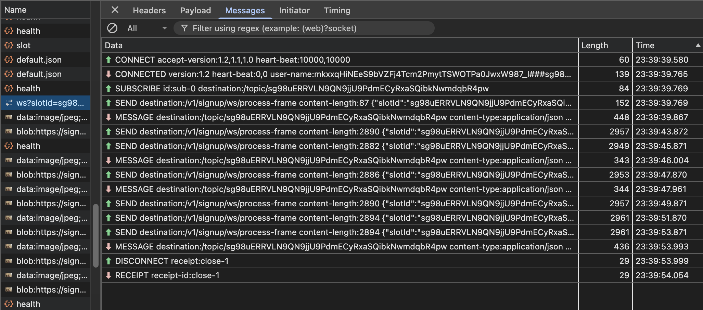

## Overview

Claims in a user profile can be verified by any trusted verifier. Verified claims and the verification metadata itself could 
be stored in the ID registry. An authenticated user can go through the verification process in signup portal to update his/her profile
with verification metadata and mark claims as verified.

Signup portal should display list of Verifier's and end user should be able to choose one among them and start the verification process.
Verification process can be online or offline involving manual steps or consist of both online & manual steps. 

Considering online verification in-scope for 1.1.0, video based online verification process is designed and supported in signup portal.
Below steps can be covered with online video based process:
1. Liveness check
2. Face match
3. Document verification
4. Disability check

Each verification process can be a combination of the above steps. Signup service should be able to **start**
the process and **end** the verification proces. Once the **end** step is reached, verifier plugin should be ready with 
the verification result. Verification result is updated in the integrated ID repository against the authenticated user record.

### How is the user authenticated context shared with the signup portal?
Any OpenID provider carries out authentication of user before the verification process. With eSignet as OP, authenticated 
user's transaction is shared as an id_token_hint to the signup portal. Signup portal now takes the role of an RP and starts OIDC flow in eSignet with "mosip:idp:acr:id-token" ACR. As the authroize request
already contains id_token_hint, user will not be prompted to enter credentials, but still may prompt user to provide consent only if required. Most of 
the time, "sub" claim in the userinfo response should suffice the requirement.

## Provision to integrate with any Identity verification workflow
Signup service has a provision to add any steps between **start** and **end** step in the verification workflow. We have defined [IdentityVerifierPlugin.java](../../signup-integration-api/src/main/java/io/mosip/signup/api/spi/IdentityVerifierPlugin.java) 
abstract class. Verifier should only take care of 

1. Initializing every workflow run with required configuration based on the provided input. 
2. Verify the input frame based on the current step and publish the feedback or details about the next step to a kafka topic (publishAnalysisResult concrete method is already defined in the plugin abstract class).
3. Once the verifier decides to **end** the workflow run, it should hint the signup service by publishing **end** step details using the same publishAnalysisResult concrete method.
4. After the completion of the verification process transaction is marked as **RESULTS_READY** status.
5. Signup UI initiates status call (polling). status endpoint invokes getVerificationResult method implemented in the IdentityVerifierPlugin. VerificationResult can either be failure or successful. The same will be conveyed to the end user.

#### Below depicts the transition of IdentityVerification transaction status:

STARTED --> RESULTS_READY --> UPDATE_PENDING --> COMPLETED/FAILED

#### Usage of cache in storing the details of the verification process:

identity_verification --> slot_allotted --> verified_slot

Slot added to slots_connected once slot is allotted. Additionally we also have:

* script to clear expired slots from slots_connected, verified_slot
* script to get current number of allotted slots
* script to update TTL for a specific slot in slots_connected cache

#### Below screenshot shows the WS command flow after acquiring a verified slot:

### How to add Verifier and its workflow details?

1. Verifier details should be added [signup-identity-verifier-details.json](../../signup-service/src/main/resources/signup-identity-verifier-details.json)
2. Create a json file with workflow details, file should be named after the verifier ID as defined in the [signup-identity-verifier-details.json](../../signup-service/src/main/resources/signup-identity-verifier-details.json)

Refer [signup-idv_mock-identity-verifier.json](../../signup-service/src/main/resources/signup-idv_mock-identity-verifier.json) the sample workflow details file. Note the file name is prepended with constant "signup-idv_"

## Out of Scope features of verifier plugin

1. Option to retry on verification failure without having to re-authenticate.
2. Option to retry any step in the verification process.
3. handling timeouts in the verification process in a user-friendly manner.