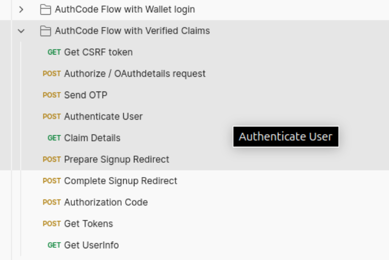
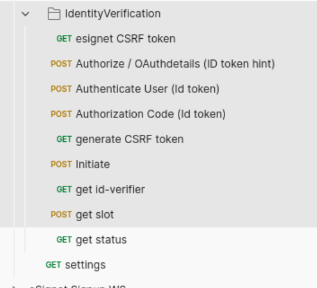
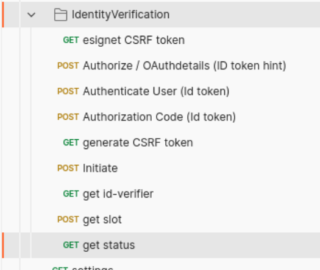
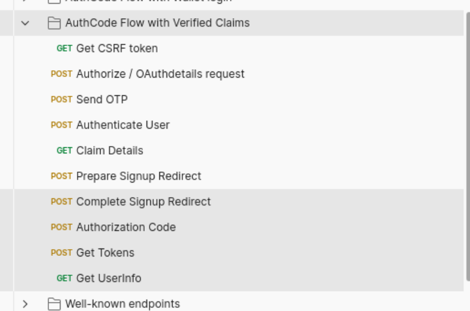

## Signup service postman collection

Collection contains 3 folder, each containing requests for 3 different operations:

1. Registration - contains sequence of requests to register a new user in the plugged in ID registry
2. Reset password - contains sequence of requests to reset password for an already created user.
3. Identity(eKYC) verification - Sequence of requests to initiate identity verification process. Prior to this 
request a valid authorization code should be generated. Using eSignet collection/verified claims folder one
can obtain the authorization code and the id-token-hint. Highlighted requests in the below screenshot(eSignet postman collection) should be executed
before starting with Identity verification flow in signup postman collection.

Once above highlighted requests are successfully completed, continue with below sequence of requests

In the identity verification folder once the slot-id is returned in the "slot" endpoint response. One should run the ws_client.py to 
carry out the video identity(eKYC) verification process using a WebSocket connection. Kindly refer `Usage of ws_client.py` section below.

**Note:** Mock plugin does not validate the frames in the current version.

With completion of verification process with web socket client, invoke the last status endpoint. status returned in the response should be "completed" 
in the flow.

With completion of sequence of request we should resume back the flow in the eSignet collection to complete E2E OIDC flow.

## Prerequisite to run Identity verification flow from postman collection

1. Onboard signup-service as a OIDC client in esignet-service:

Execute [create-signup-oidc-keystore.sh](create-signup-oidc-keystore.sh) to generate a keypair. This script after
successful execution creates 2 files in the project root directory:

* oidckeystore.p12
* public_key.jwk

As esignet only supports confidential OIDC clients, we should generate a RSA keypair to onboard signup-service. RSA private key is
stored in the oidckeystore.p12 file and the corresponding public key is written to public_key.jwk file.

Copy the public key in public_key.jwk file and update the same in the `Register Signup OIDC/Create Signup OIDC client` request body.

Run `Register Signup OIDC/Create Signup OIDC client` in postman before starting the identity verification flow.

## Usage of [ws_client.py](ws_client.py)

eKYC verification process is carried out through WebSocket connection and as postman currently does not support export of WS 
collections, we have created [ws_client.py](ws_client.py) script.

This script is a simple Python WebSocket client that connects to a specified WebSocket server, subscribes to a topic using 
the STOMP protocol, and allows the user to send messages to that topic.

## Overview of the Script
User Input:

The script starts by asking the user for the WebSocket server URL, slot ID, and cookie value.

If you are running eSignet signup service in local, then the url will be "ws://localhost:8089/v1/signup/ws"
Slot ID and IDV_SLOT_ALOTTED cookie value should be taken from 'http://localhost:8088/v1/signup/identity-verification/slot' endpoint response.

## WebSocket Callbacks:

Several callback functions handle different events during the WebSocket connection lifecycle:
on_message: Called when a message is received from the server.
on_error: Called when an error occurs during the WebSocket operation.
on_close: Called when the WebSocket connection is closed.
on_open: Called when the WebSocket connection is successfully established.

## STOMP Protocol Frames:

The script uses the STOMP protocol to communicate with the WebSocket server, sending:
A CONNECT frame to initiate the STOMP connection.
A SUBSCRIBE frame to listen for messages on a specified topic (based on the user-provided slot_id).
A SEND frame to send messages from the user input to the specified destination.

## Threading for User Input:

The send_user_input function runs in a separate thread, allowing the main thread to continue processing incoming messages while waiting for user input.
The user can enter messages to send to the server or type "exit" to close the connection.

## WebSocket Connection Management:

The start_ws_client function sets up the WebSocket connection using the websocket-client library, specifying the URI and headers (including cookies).
The connection is established with ws.run_forever(), which keeps the connection alive and processes incoming messages.

## How to use the script?
1. Install Required Library: Ensure you have the websocket-client library installed. You can install it using:

`pip install websocket-client`

2. Run the Script: Execute the script in your terminal or command prompt:

`python <path to ws_client.py script>`

3. Provide Input: When prompted, enter the base URL (WebSocket server address), slot ID, and cookie value.

4. Sending Messages: When prompted, to enter message to send, type the message as below, there are 2 different messages

START step message -> `{"slotId":"<allotted slotId>","stepCode":"START","frames":[{"frame":"dummy-frame","order":"0"}]}`

Other step messages -> `{"slotId":"<allotted slotId>","stepCode":"<step_name as in the received messages>","frames":[{"frame":"dummy-frame","order":"0"}]}`

5. Receiving Messages: Any messages sent from the server to the subscribed topic will be printed to the console as they are received. On receiving message
with step code as "END" from the server denotes the closure of frame verification process. Hence the websocket connection can be closed by the client.

## Example interaction

