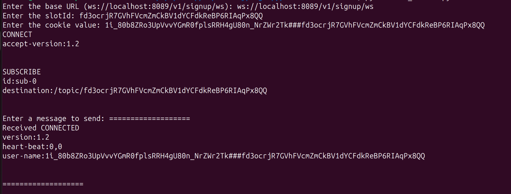
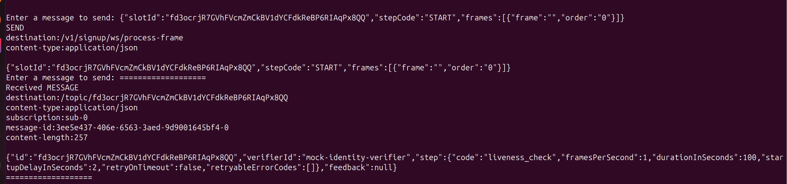

## Usage of [ws_client.py](ws_client.py)

eKYC verification process is carried out through WebSocket connection and as postman currently does not support export of WS 
collections, we have created [ws_client.py](ws_client.py) script.

This script is a simple Python WebSocket client that connects to a specified WebSocket server, subscribes to a topic using 
the STOMP protocol, and allows the user to send messages to that topic.

## Overview of the Script
User Input:

The script starts by asking the user for the WebSocket server URL, slot ID, and cookie value.

If you are running eSignet signup service in local, then the url will be "ws://localhost:8089/v1/signup/ws"
Slot ID and IDV_SLOT_ALOTTED cookie value should be taken from 'http://localhost:8088/v1/signup/identity-verification/slot' endpoint response.

## WebSocket Callbacks:

Several callback functions handle different events during the WebSocket connection lifecycle:
on_message: Called when a message is received from the server.
on_error: Called when an error occurs during the WebSocket operation.
on_close: Called when the WebSocket connection is closed.
on_open: Called when the WebSocket connection is successfully established.

## STOMP Protocol Frames:

The script uses the STOMP protocol to communicate with the WebSocket server, sending:
A CONNECT frame to initiate the STOMP connection.
A SUBSCRIBE frame to listen for messages on a specified topic (based on the user-provided slot_id).
A SEND frame to send messages from the user input to the specified destination.

## Threading for User Input:

The send_user_input function runs in a separate thread, allowing the main thread to continue processing incoming messages while waiting for user input.
The user can enter messages to send to the server or type "exit" to close the connection.

## WebSocket Connection Management:

The start_ws_client function sets up the WebSocket connection using the websocket-client library, specifying the URI and headers (including cookies).
The connection is established with ws.run_forever(), which keeps the connection alive and processes incoming messages.

## How to use the script?
1. Install Required Library: Ensure you have the websocket-client library installed. You can install it using:

`pip install websocket-client`

2. Run the Script: Execute the script in your terminal or command prompt:

`python ws_client.py`

3. Provide Input: When prompted, enter the base URL (WebSocket server address), slot ID, and cookie value.

4. Sending Messages: When prompted, to enter message to send, type the message as below, there are 3 different messages

START step message -> `{"slotId":"slotId","stepCode":"START","frames":[{"frame":"","order":"0"}]}`

Other step messages -> `{"slotId":"slotId","stepCode":"<step_name as in the received messages>","frames":[{"frame":"","order":"0"}]}`

END step message -> `{"slotId":"slotId","stepCode":"END","frames":[{"frame":"","order":"0"}]}`

5. Receiving Messages: Any messages sent from the server to the subscribed topic will be printed to the console as they are received.

## Example interaction

